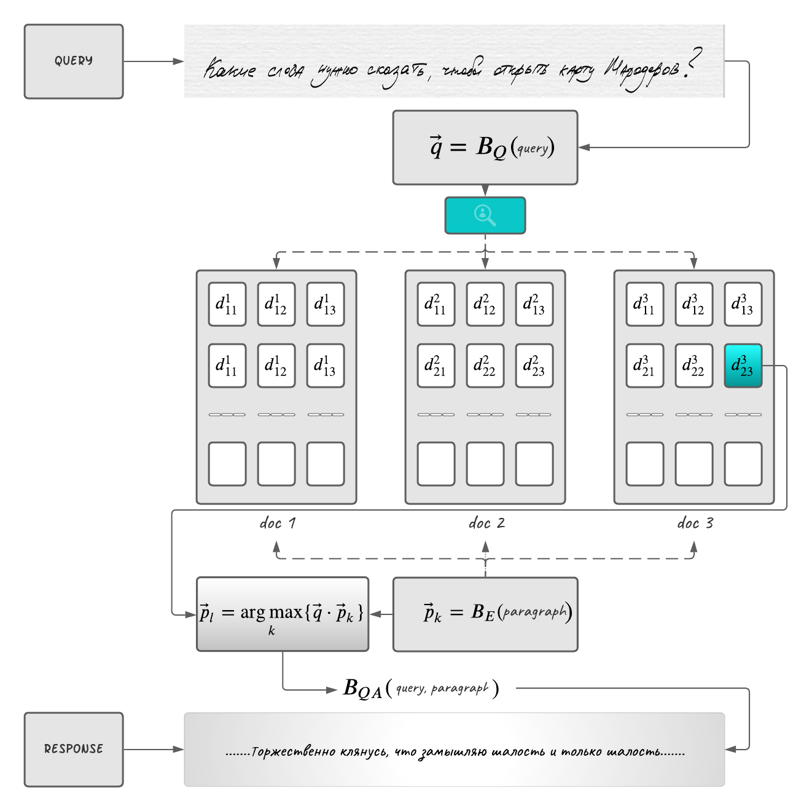

## _ATOM on open-domain neural search and question answering at scale_
====================================

<h2 align="center"><i>A Transformer Orchestration Model on open-domain neural search and question answering at scale</i></h2>

Today, neural search and question answering rely on effiecent retrieval procedure to select approximate candidates to the given query. Well-known sparce vector models, such as `BM25` wrapped around `TF-IDF` score modeling, provide strong baseline. Famous `ElasticSearch` distributed system which is built on top of `Lucene` library provide working and reliable solution in a majority of 
real-world scenarios.
This research is aimed to show that retrieving `top-k` candidates can be practically implemented using any custom mapping `f(x) ∈ R^n` thanks to the open-sourced tools such as 
<a href="https://github.com/facebookresearch/faiss">FAISS</a> and <a href="https://milvus.io/">MILVUS</a> search engines.


<h2 align="center">Definition</h2>

Formally, given the query `Q` and the collections of documents
```
C = {d_1, d_2, ..., d_n}
```
which are itself splitted into smaller chunks or paragraphs
```
P = {p_1, p_2, ..., p_m}, m >> n
```
one has to find the `top-k` (`k <= 10`) 
paragraphs among which the desired answer to the query `Q` is presented and the task itself is to find a span of words in those `top-k` paragraphs such that:
```
{w_s, ... , w_e}
```
is the answer to the query.



